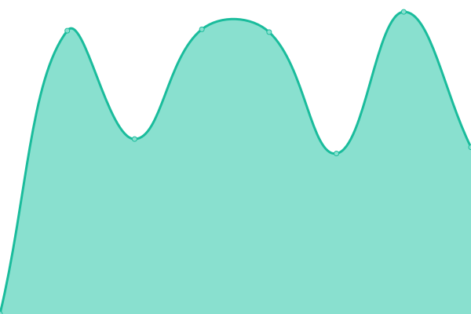
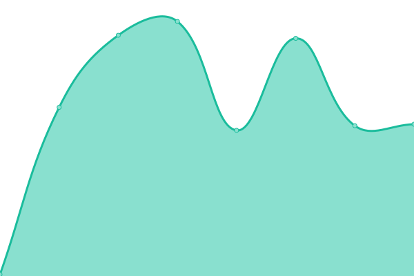
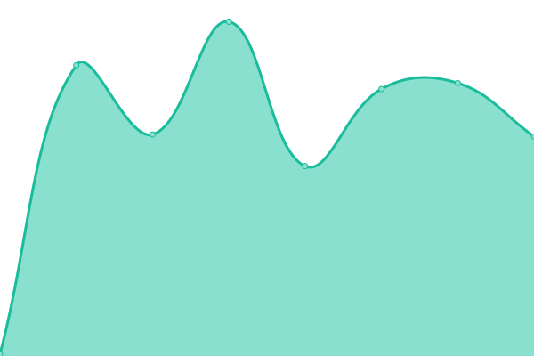

# [📈 Live Status](https://intecom1980.github.io/upptime): <!--live status--> **🟧 Partial outage**

This repository contains the open-source uptime monitor and status page for [INTECOM](www.intecom.cat), powered by [Upptime](https://github.com/upptime/upptime).

With [Upptime](https://upptime.js.org), you can get your own unlimited and free uptime monitor and status page, powered entirely by a GitHub repository. We use [Issues](https://github.com/intecom1980/upptime/issues) as incident reports, [Actions](https://github.com/intecom1980/upptime/actions) as uptime monitors, and [Pages](https://intecom1980.github.io/upptime) for the status page.

<!--start: status pages-->
<!-- This summary is generated by Upptime (https://github.com/upptime/upptime) -->
<!-- Do not edit this manually, your changes will be overwritten -->
<!-- prettier-ignore -->
| URL | Status | History | Response Time | Uptime |
| --- | ------ | ------- | ------------- | ------ |
|  [SRV INTECOM CLOUD](https://srv.intecom.cloud) | 🟥 Down | [srv-intecom-cloud.yml](https://github.com/intecom1980/upptime/commits/HEAD/history/srv-intecom-cloud.yml) | 

 0ms
     
 | 

<a href="https://status.intecom.cloud/history/srv-intecom-cloud">0.00%</a>
    

|  [S1 INTECOM CLOUD](https://s1.intecom.cloud) | 🟩 Up | [s1-intecom-cloud.yml](https://github.com/intecom1980/upptime/commits/HEAD/history/s1-intecom-cloud.yml) | 

 1276ms
     
 | 

<a href="https://status.intecom.cloud/history/s1-intecom-cloud">100.00%</a>
    

|  [UNIFI INTECOM](https://unifi.intecom.cat) | 🟥 Down | [unifi-intecom.yml](https://github.com/intecom1980/upptime/commits/HEAD/history/unifi-intecom.yml) | 

 0ms
     
 | 

<a href="https://status.intecom.cloud/history/unifi-intecom">0.00%</a>
    

|  [Golf Mar 2](http://84a107d35b90.sn.mynetname.net/) | 🟥 Down | [golf-mar-2.yml](https://github.com/intecom1980/upptime/commits/HEAD/history/golf-mar-2.yml) | 

 0ms
     
 | 

<a href="https://status.intecom.cloud/history/golf-mar-2">0.00%</a>
    

|  [GOLF RELAX](a36a0c0ae39e.sn.mynetname.net) | 🟩 Up | [golf-relax.yml](https://github.com/intecom1980/upptime/commits/HEAD/history/golf-relax.yml) | 

 153ms
     
 | 

<a href="https://status.intecom.cloud/history/golf-relax">100.00%</a>
    

<!--end: status pages-->

[**Visit our status website →**](https://intecom1980.github.io/upptime)

## 📄 License

- Powered by: [Upptime](https://github.com/upptime/upptime)
- Code: [MIT](./LICENSE) © [INTECOM](www.intecom.cat)
- Data in the `./history` directory: [Open Database License](https://opendatacommons.org/licenses/odbl/1-0/)
